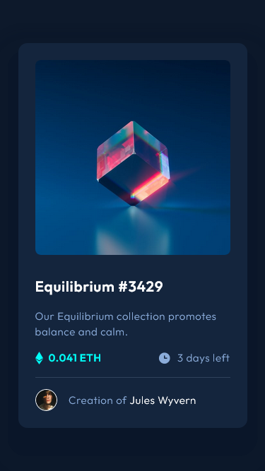
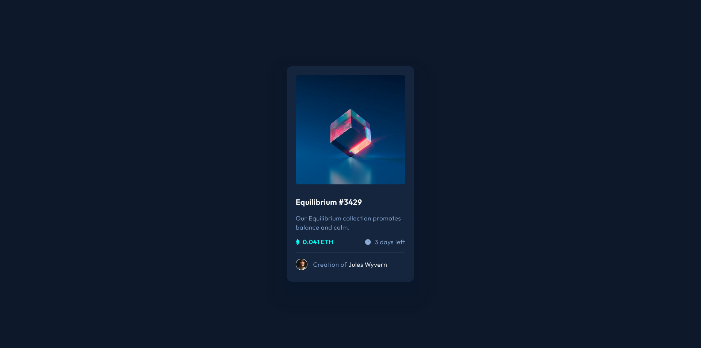

# Frontend Mentor - NFT preview card component solution

This is a solution to the [NFT preview card component challenge on Frontend Mentor](https://www.frontendmentor.io/challenges/nft-preview-card-component-SbdUL_w0U). Frontend Mentor challenges help you improve your coding skills by building realistic projects. 

## Table of contents

- [Overview](#overview)
  - [The challenge](#the-challenge)
  - [Screenshot](#screenshot)
  - [Links](#links)
- [My process](#my-process)
  - [Built with](#built-with)
  - [What I learned](#what-i-learned)
  - [Continued development](#continued-development)
- [Author](#author)

## Overview

### The challenge

Users should be able to:

- View the optimal layout depending on their device's screen size
- See hover states for interactive elements

### Screenshot




### Links

- Solution URL: [Github](https://github.com/MikeBeloborodov/NFT_preview_card)
- Live Site URL: [Netlify](https://classy-pony-44f993.netlify.app/)

## My process

### Built with

- Semantic HTML5 markup
- CSS custom properties
- Flexbox
- CSS Grid
- Mobile-first workflow

### What I learned

I've learned how to put a hidden div over an image to make it appear on hover:

```CSS
.card__img-cover {
    border-radius: 0.65rem;
    cursor: pointer;
    position: relative;
}

.card__img {
    border-radius: 0.5rem;
    position: relative;
}

.card__img-eye {
    position: absolute;
    width: 50px;
    height: auto;
    top: 0;
    left: 0;
    opacity: 0;
    padding: 7.1rem 7.1rem;
    background-color: hsla(178, 100%, 50%, 0.5);
    border-radius: 0.5rem;
}

.card__img-eye:hover {
    opacity: 1;
}
```
It's not perfect and will break on extra small screens, but it works for this challenge

I also had first time experience with fitting svg icons into paragraphs, took a while but I figured out this way:

```CSS
.card__time-clock {
    width: auto;
    height: 20px;
}
```
It's not good that it has static size, but it did the job.

### Continued development

I think I use rem and px too arbitrarily, gotta learn some rules and stick to them.

## Author

- Github - [Mike Beloborodov](https://github.com/MikeBeloborodov)
- Frontend Mentor - [@MikeBeloborodov](https://www.frontendmentor.io/profile/MikeBeloborodov)